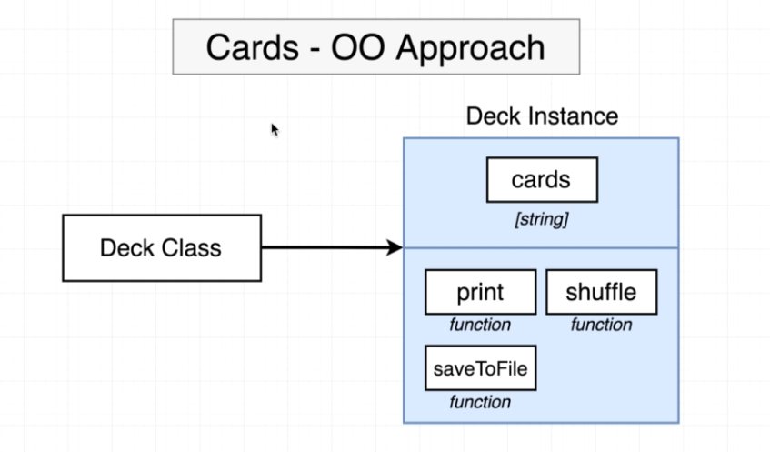
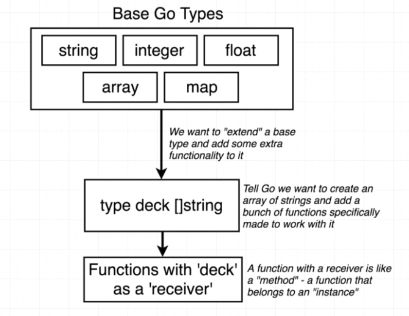
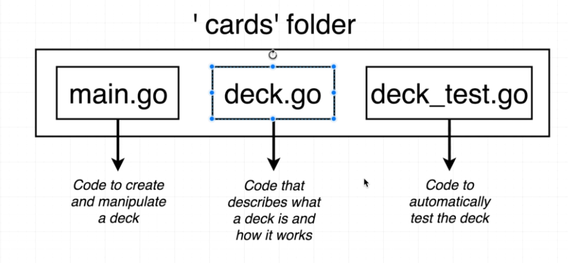

# Go: The Complete Developer's Guide

## 1. Hello World Application

```go
package main

import "fmt"

func main() {
	fmt.Println("Hello World")
}
```

### 1.1. How do we run the code in the project?

- `go run main.go`
- `go build main.go && ./main.exe`
- `go run *.go`
- `go test ./...`

Go CLI

- `go build`: Compiles a bunch of `go` source code files
- `go run`: Compiles and executes
- `go fmt`: Formats all the code in each file in the current directory
- `go install`: Compiles and "installs" a package
- `go get`: Downloads the raw source code of someone else's package
- `go test`: Runs any tests associated with the current project

### 1.2. What does `package main` mean?

`package == project == workspace`

A package can have multiple related files inside of it.

Type of packages

- `executable`: Generates a file that we can run: `package main`
- `reusable`: Code used as `helpers`. Good place to put reusable logic

### 1.3. What does `import "fmt"` mean?

Provide access from our package to another packages. `golang.org/pkg`

### 1.4. What's that `func` thing?

Function.

### 1.5. How is the `main.go` file organized?

- package declaration: `package main`
- import other packages that we need: `import fmt`
- declare functions, tell Go to do things: `func main() {}`

## 2. Cards Project

Cards

- newDeck: Create a list of playing cards. Essentially an array of strings 
- print: Log out the contents of a deck of cards
- shuffle: Shuffles all the cards in a deck
- deal: create a 'hand' of cards
- saveToFile: save a list of cards to a file on the local machine
- newDeckFromFile: load a list of cards from the local machine

### 2.1. Variables

```go
func main()  {
	var s1 string = "string 1"
	s2 := "string 2"
	
	var s3 string 
	s3 = "string 3"
	
	fmt.Println(s1, s2, s3)
}
```

Basic Go types

- bool
- string
- int
- float64

### 2.2. Functions and Return types

```go
func newCard() string {
	return "Five of Diamonds"
}
```

### 2.3. Slices and For loop
	
- Array: fixed length list of things
- Slice: an array that can grow or shrink (recommended)

Declare a `slice of string`.
```go
func main()  {
	cards := []string {
		"Hieu",
		"Ha",
	}

	fmt.Println(cards)
}
```

Add new element to a `slice`

```go
cards = append(cards, "hello")
```

Iterate over a `slice`

```go
for i, card := range cards {
	fmt.Println(i, card)
}
```

### 2.4. OO Approach vs Go Approach

`Go` is not an `OOP` language.

OOP Approach



Go Approach



Project structure



### 2.5. Custom type declaration 

```go
type deck []string
```

Attach `function` to `custom type`

```go
func (d deck) print() {
	for i, card := range d {
		fmt.Println(i+1, card)
	}
}
```
