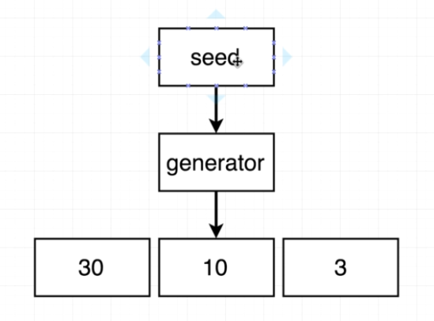

# Go: The Complete Developer's Guide

## 1. Hello World Application

```go
package main

import "fmt"

func main() {
	fmt.Println("Hello World")
}
```

### 1.1. How do we run the code in the project?

- `go run main.go`
- `go build main.go && ./main.exe`
- `go run *.go`
- `go test ./...`

Go CLI

- `go build`: Compiles a bunch of `go` source code files
- `go run`: Compiles and executes
- `go fmt`: Formats all the code in each file in the current directory
- `go install`: Compiles and "installs" a package
- `go get`: Downloads the raw source code of someone else's package
- `go test`: Runs any tests associated with the current project

### 1.2. What does `package main` mean?

`package == project == workspace`

A package can have multiple related files inside of it.

Type of packages

- `executable`: Generates a file that we can run: `package main`
- `reusable`: Code used as `helpers`. Good place to put reusable logic

### 1.3. What does `import "fmt"` mean?

Provide access from our package to another packages. `golang.org/pkg`

### 1.4. What's that `func` thing?

Function.

### 1.5. How is the `main.go` file organized?

- package declaration: `package main`
- import other packages that we need: `import fmt`
- declare functions, tell Go to do things: `func main() {}`

## 2. Cards Project

Cards

- newDeck: Create a list of playing cards. Essentially an array of strings 
- print: Log out the contents of a deck of cards
- shuffle: Shuffles all the cards in a deck
- deal: create a 'hand' of cards
- saveToFile: save a list of cards to a file on the local machine
- newDeckFromFile: load a list of cards from the local machine

### 2.1. Variables

```go
func main()  {
	var s1 string = "string 1"
	s2 := "string 2"
	
	var s3 string 
	s3 = "string 3"
	
	fmt.Println(s1, s2, s3)
}
```

Basic Go types

- bool
- string
- int
- float64

### 2.2. Functions and Return types

```go
func newCard() string {
	return "Five of Diamonds"
}
```

### 2.3. Slices and For loop
	
- Array: fixed length list of things
- Slice: an array that can grow or shrink (recommended)

Declare a `slice of string`.
```go
func main()  {
	cards := []string {
		"Hieu",
		"Ha",
	}

	fmt.Println(cards)
}
```

Add new element to a `slice`

```go
cards = append(cards, "hello")
```

Iterate over a `slice`

```go
for i, card := range cards {
	fmt.Println(i, card)
}
```

### 2.4. OO Approach vs Go Approach

`Go` is not an `OOP` language.

OOP Approach


Go Approach


Project structure


### 2.5. Custom type declaration 

```go
type deck []string
```

Attach `function` to `custom type`

```go
func (d deck) print() {
	for i, card := range d {
		fmt.Println(i+1, card)
	}
}
```

### 2.6. Receiver Functions

```go
func (d deck) print() {
	for i, card := range d {
		fmt.Println(i+1, card)
	}
}
```

Any variable of type `deck` now gets access to the `print` method.

The `receiver` sets up `methods` on `variables`.


```go
func main() {
	cards := deck{}

	cards.print()
}

```

We can imagine that went we call `cards.print()`, the `cards` variable is passed into the `print` method as `d` (`d deck`).

We can think of `receiver` `(d deck)` as the `this` keyword in `OOP`.

### 2.7. Creating a new `deck`

```go
func newDeck() deck {
	cards := deck{}

	cardSuits := []string{"Spades", "Diamonds", "Hearts", "Clubs"}
	cardValues := []string{"Ace", "Two", "Three", "Four", "Five", "Six", "Seven", "Eight", "Nine", "Ten", "Jack", "Queen", "King"}

	for _, suite := range cardSuits {
		for _, value := range cardValues {
			cards = append(cards, fmt.Sprintf("%v of %v", suite, value))
		}
	}

	return cards
}
```

### 2.8. `slice range` syntax


Slice range syntax


### 2.9. Multiple return values

```go
func deal(d deck, handSize int) (deck, deck, error) {
	if len(d) < handSize {
		return nil, nil, errors.New("not enough cards")
	}

	return d[:handSize], d[handSize:], nil
}
```

### 2.10. `bytes slice`

A more computer friendly way of thinking about a `string`


### 2.11. `deck to string` (deck to slice of byte for writing to disk)

Type conversion: `[]byte("Hi there")`

Turn a `deck` into a `slice` of `byte`


`toString` function

```go
func (d deck) toString() string {
	return strings.Join([]string(d), ",")
}
```

Saving data to the Hard drive

```go
func (d deck) saveToFile(filename string) error {
	return ioutil.WriteFile(filename, []byte(d.toString()), 0666)
}
```

Call the `function`

```go
func main() {
	cards := newDeck()

	err := cards.saveToFile("data.txt")
	if err != nil {
		return 
	}
}
```

### 2.12. Reading from hard drive

Error type


Reading from hard drive

```go
func newDeckFromFile(filename string) (deck, error) {
	bs, err := ioutil.ReadFile(filename)

	if err != nil {
		return nil, err
	}

	s := string(bs)
	ss := strings.Split(s, ",")

	return deck(ss), nil
}
```

Using function

```go
func main() {
	cards, err := newDeckFromFile("data.txt")

	if err != nil {
		log.Fatal(err.Error())
	}

	cards.print()
}
```

### 2.13. Shuffling a deck

Shuffling a deck of cards


Random number generation



```go
func (d deck) shuffle() {
	l := len(d) - 1
	source := rand.NewSource(time.Now().UnixNano())
	r := rand.New(source)

	for i, _ := range d {
		newPosition := r.Intn(l)

		d[i], d[newPosition] = d[newPosition], d[i]
	}
}
```

### 2.14. Testing with `Go`

- Go testing is not mocha, jasmine, selenium, etc
- To make a test, create a new file ending in `_test.go`: `deck_test.go`
- To run all tests in a package, run the command: `go test ./...`

Test Structure


Test Strategy


Test length of the new deck

```go
func TestNewDeck(t *testing.T) {
	d := newDeck()
	expected := 52

	if len(d) != expected {
		t.Errorf("Expected deck length of %v but got %v", expected, len(d))
	}
}
```

Continue

```go
func TestNewDeck(t *testing.T) {
	d := newDeck()
	expected := 52

	if len(d) != expected {
		t.Errorf("Expected deck length of %v but got %v", expected, len(d))
	}

	fCard := "Ace of Spades"
	if d[0] != fCard {
		t.Errorf("Expected first card of %v, but got %v", fCard, d[0])
	}

	lCard := "King of Clubs"
	if d[len(d)-1] != lCard {
		t.Errorf("Expected last card of %v, but got %v", lCard, d[len(d)-1])
	}
}
```