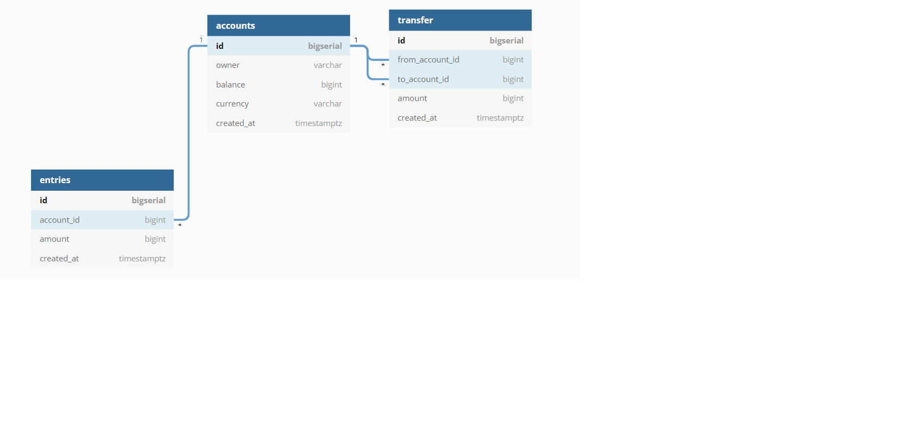

# Backend Master Class (Golang + PostgreSQL + Kubernetes)

Application we will build: A simple bank

- Create and manage account: owner, balance, currency
- Record all balance changes: create an account entry for each change
- Money transfer transaction: perform money transfer between 2 accounts consistently within a transaction

## 1. Database design

- Design DB schema: design a SQL DB schema using `dbdiagram.io`
- Save & share DB diagram: save the DB schema as PDF/PNG diagram and share it with your team
- Generate code to create the schema in a target database engine: Postgres/MySQL/SQL Server



Code

```html
table accounts as A {
  id bigserial [pk]
  owner varchar [not null] 
  balance bigint [not null]
  currency varchar [not null]
  created_at timestamptz [default: `now()`]
  
  // Search account by an owner
  indexes {
    owner
  }
}

// Record all changes to the accounts table
table entries {
  id bigserial [pk]
  account_id bigint [not null, ref: > A.id]
  amount bigint [not null, note: 'can be positive or negative']
  created_at timestamptz [default: `now()`]
  
  // List all entries of an account
  indexes {
    account_id
  }
}

// Record all money transfer between two accounts
table transfer {
  id bigserial [pk]
  from_account_id bigint [not null, ref: > A.id]
  to_account_id bigint [not null, ref: > A.id]
  amount bigint [not null, note: 'must be positive']
  created_at timestamptz [default: `now()`]
  
  indexes {
    from_account_id
    to_account_id
    (from_account_id, to_account_id)
  }
}	
```

## 2. Install Docker


### 2.1. Prepare Postgres Container 

- Pulling the postgres image: `docker pull postgres:12-alpine`, using alpine version for smaller size.
- Run the container: `docker run --name postgres12 -p 5432:5432 -e POSTGRES_USER=root -e POSTGRES_PASSWORD=secret -d postgres:12-alpine`
- Run the command inside the container: `docker exec -it postgres12 psql -U root`

### 2.2. Connect to Postgres using TablePlus

- Open TablePlus
- Enter connected information
  - host: localhost
  - port: 5432
  - user: root
  - password: secret
  - database: root (default the same name as user name)
