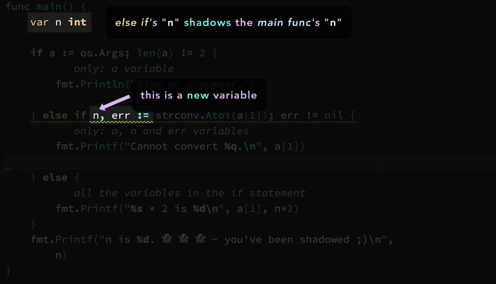

# Go Bootcamp: Master Golang with 1000+ Exercises and Projects

[Udemy](https://udemy.com/course/learn-go-the-complete-bootcamp-course-golang/)

## Basics

### Introduction to Variables

> Declaration syntax: You need to declare a variable before
> you can use it

```go
var n int
```

- `var`: keyword
- `n`: name of the variable, also known as an `identifier`
- `int`: variable's type determines what `type of values` you
  can store in a variable (`strongly-typed`)

There are only two hard things in computer science:

- cache invalidation
- naming things

Names should start with a `letter` or an `underscore`. `Unicode letters` are also OK

```go
package main
import "fmt"

func main() {
    var speed int
    fmt.Println(speed) // 0
}
```


### Example: `path seperator`

Let's learn how to use multiple result returning expressions
in multiple assignments

`path package` provides utility functions for working with `url path` strings

`Split` function signature

- Input: `path` string
- Output: `directory` and `file`, both have type of `string`

```go
func Split(path string) (dir, file string) {}
```


```go
import ( "fmt"; "path" )

func main() {
    var dir, file string
    dir, file = path.Split("css/main.css")

    // discard
    // _, file = path.Split("css/main.css")

    fmt.Println("dir: ", dir)
    fmt.Println("file: ", file)
}
```

Or using `short declaration`: `:=`

```go
import ( "fmt"; "path" )

func main() {
    dir, file := path.Split("css/main.css")

    // discard
    // _, file := path.Split("css/main.css")

    fmt.Println("dir: ", dir)
    fmt.Println("file: ", file)
}
```

### When to use a `short declaration`?

`Short` vs `Normal`

Use `normal declaration`:

- if you don't know the `initial value`
- when you need a `package scoped` variable
- when you want to group variables together for greater readability

```go
package main

// version := 0
var version int

func main() {
    // score := 0 // DONT!
    var score int // already score = 0

    var (
        // related:
        video string

        // closely related
        duration int
        current it
    )
}
```

Use `short declaration`:

- we mostly perfer using `short declaration`
- if you know the `initial value`
- to keep the code concise
- for `redeclaration`
- using inside `if` and `switch` statements to create variables that belong to those statements only

```go
package main

func main() {
    // var width, height = 100, 50 // DONT!
    width, height := 100, 50

    // DONT!
    width = 50 // assigns 50 to width
    color := "red" // new variable: color

    // using redeclaration
    // change width to 50, declare color = red
    width, color := 50, "red"
}
```

### Let's convert a value

GO just wants you to be explicit on everything. That's why it
doesn't let you assign a `float64` to an `int` value.

`Type conversion`: changes the `type` of a value to `another type`

Which value you convert first matters.

Signature: `type(value)`

```go
package main

func main() {
    speed := 100 // int
    force := 2.5 // float64

    speed = int( float64(speed) * force )
}
```

### Example: Get input from terminal

`os package` allows you to access to `operating system functionalities`

`Args` variable belongs to the `os package`

`var Args []string`:

- a slice can store multiple values
- Args's type is a `slice of string`

When you run a Go program, Go puts `the command-line arguments` into `Args` variable automatically

#### Learn the basics of `os.Args

```go
package main

import (
    "fmt"
    "os"
)

func main() {
    fmt.Printf("%v\n", os.Args)

    fmt.Println("Path:", os.Args[0])
    fmt.Println("1st argument", os.Args[1])
    fmt.Println("2nd argument", os.Args[2])

    fmt.Println("Number of items inside os.Args:", len(os.Args))
}
```

#### Naming things: Recommendations

> There only two hard things in computer science:
> cache invalidation and naming things

- `non-idiomatic` means `not preferred` usage
- `idiomatic` means `preffered` usage

Some common abbreviations used in `Go`

- `var s string`: string
- `var i int`: index
- `var num int`: number
- `var msg string`: message
- `var v string`: value
- `var val string`: value
- `var fv string` flag value
- `var err error`: error value
- `var args []string`: arguments
- `var seen bool`: has seen?
- `var parsed bool`: parsing ok?
- `var buf []byte`: buffer
- `var off int`: offset
- `var op int`: operation
- `var opRead int`: read operation
- `var l int`: length
- `var n int`: number of number of
- `var m int`: another number
- `var c int`: capacity
- `var c int`: character
- `var a int`: array
- `var r rune`: rune
- `var sep string`: separator
- `var src int`: source
- `var dst int`: destination
- `var b byte`: byte
- `var b []byte`: buffer
- `var buf []byte`: buffer
- `var w io.Writeer`: writer
- `var r io.Reader`: reader
- `var pos int`: position

Recommendations

- Use the first few letters of the words: `var fv string // flag value`
- Use fewer letters in smaller scopes (`block` | `function`)

```go
var bytesRead int // number of bytes read // DONT
var n int // number of bytes read
```

- Use the complete words in larger scopes (`package scope`)
- Use `mixedCaps` like this
- Use all `captitals` for acronyms

```go
var localAPI string // DONT
var localApi string // DO
```

- Do not stutter: do not use the same words again and again

```go
var p := player.PlayerScore; // DONT
p := player.Score; // DO
```

- Do not use `under_scores` or `LIKE_THIS`

```golang
const MAX_TIME int // DONT
const MaxTime int // DO
```

### What is a Raw string literal?

Time to learn about the basics of strings

- Raw string literal
- Concatenation
- String length
- Project

```go
// string literal
var s1 = "<html?>\n\t<body>\"Hello\"</body>\n</html>"

// raw string literal
var s2 = `
    <html>
        <body>"Hello"</body>
    </html>
`

// string literal
var p1 = "c:\\my\\dir\\file"

// raw string literal
var p2 = `c:\my\dir\file`
```

### How to get the length of a `utf-8` string?

`len` built-in function returns the length of a string value in `bytes`

```go
func main() {
    name := "carl"
    fmt.Println(len(name)) // 4
}
```

For `utf-8` character, `len` only returns the length of a string value in `bytes`


`utf8` package's `RuneCountInString` function finds the
number of characters in a string.

```go
import ( "fmt"; "unicode/utf8" )

func main() {
    name := "Hiếu"

    fmt.Println(utf8.RuneCountInString(name))
}
```

> There is no sub-packaging in Go

- `unicode/utf8`
- `utf8` package is just under the `unicode` folder
- this is only for the package organization purposes
- the real name of the package is only `utf8`

> A `rune` can represent `English` and `Non-English` characters
> as well.

For example: `hiếu` has 4 `runes` (aka: `codepoints`)

So, when you work with `non-english` characters and first
string value is `utf8` encoded, you should always use this function `utf8.RuneCountInString(name)`

### Example: Banger: Yell it back

Get input + Bang it

```sh
go run main.go hey
# => HEY!!!

go run main.go hello
# => HELLO!!!!!
```

`string package` provides utility functions for manipulating
`strings`

[Docs](https://golang.org/pkg/strings/)

Get the `string` length

- `len(msg)`: only works correctly with the `non-unicode` characters

- `utf8.RuneCountInString(name)`: works with the `non-unicode` and `unicode` characters

```go
package main

import (
    "fmt"
    "os"
    "strings"
)

func main() {
    msg := os.Args[1]
    l := len(msg)

    s := msg + strings.Repeat("!", l)
    s = strings.ToUpper(s)

    fmt.Println(s)
}
```

### Constants and `iota`

`iota` is a built-on `constant generator` which generates
ever increasing numbers

```go
func main() {
    const (
        monday = 0
        tuesday = 1
        wednesday = 2
        thursday = 3
        friday = 4
        saturday = 5
        sunday = 6
    )

    // using iota to generate random number
    const (
        monday = iota // 0 1 2 3 4 5 6
        tuesday
        wednesday
        thursday
        friday
        saturday
        sunday
    )
}
```

You can use expressions with `iota` So, the other `constants`
will `repeat` the expressions.

```go
func main() {
    const (
        monday = iota + 1 // 1 2 3 4 5 6 7
        tuesday
        wednesday
        thursday
        friday
        saturday
        sunday
    )
}
```

### `Println` vs `Printf`

`printf`: prints formatted output

- `%q\n`: formatting text, determines `what` and `how` to print
- `brand`: replace value(s), replaces the verb inside the formatting text
- `\n`: escape sequence, prints a newline

```go
func main() {
    var brand string = "Google"

    fmt.Printf("%q\n", brand) // "Google"
}
```

Println vs Printf

To print this line: `total: 2350 success: 543/433`

```go
func main() {
    fmt.Println("total:", ops, "success:", ok, "/", fail)

    // %d: integer value
    fmt.Printf("total: %d success: %d/%d \n", ops, ok, fail)
}
```

### What is an escape sequence?

Allows you to represent special characters

Go `interprets` string values

- `\n` is for printing a new line
- `\n` is an escape sequence
- `\n` is one character
- `hi\nhi` has 5 characters
- when a character starts with a `\`, it might be an `escape sequence`

- `\\`: `\`
- `\n`: new line
- `\"`: `"`

### Example: How to print using `Printf`

Printing types: you can use `printf` to print the `types of values` (variable, constants, so on ...)

```go
func main() {
    var speed int
    var heat float64
    var off bool
    var brand string

    n := 1

    // %T means type
    fmt.Printf("%T\n", speed) // int
    fmt.Printf("%T\n", heat) // float64

    // %v means value
    fmt.Printf("%v", n) // 1
}
```

Argument index

```go
func main() {
    var (
        a = 1
        b = 2
        c = a + b
    )

    fmt.Printf("%v + %v = %v || %[2]v + %[1]v = %[3]v",
        a, b, c
    )
}
```

### The verbs can be type-safe too

```go
func main() {
    var (
        str = "hello"
    )

    // warning
    fmt.Printf("%d", str)

    // OK
    fmt.Printf("%s", str)
}
```

Working with `precision`

```go
func main() {
    var (
        f = 3.14
    )

    fmt.Printf("%v", f)
    fmt.Printf("%f", f)
    fmt.Printf("%.0f", f)
    fmt.Printf("%.1f", f)
}
```

### If statement

This `if` statement will only print `godd` when the `score`
is `higher` than `3`

If statement's block is executed only if its condition expression is `true`

```go
func main() {
    score := 10

    // DONT
    if (score > 3) {
        fmt.Println("Good")
    }

    // DO
    if score > 3 {
        fmt.Println("Good")
    }
}
```

- `score > 3`: this expression should always yield a `bool` value

- `score > 3 && valid == true`: Condition expression: should always yield a `bool` value

- `score > 3 && valid`: you can use `bool` values directly

### Example: Passme

User password protection is ON!

```go
package main

import (
    "fmt"
    "os"
)

const (
    usage = "Usage: [username] [password]"
    errUser = "Access denied for %q\n"
    accessOK = "Access granted for %q\n"

    user = "hieu"
    pass = "123456"
)

func main() {
    l := len(os.Args)

    if l != 3 {
        fmt.Println(usage)
        return
    }

    u, p := os.Args[1], os.Args[2]

    if u != user && p != pass {
        fmt.Printf(errUser, u)
        return
    }

    fmt.Printf(accessOK, u)
}
```

### What is a `nil` value

`nil` is a predeclared identifier, it can be used everywhere
without importing any package.

`nil` value means that the value is `not initialized` yet.

- `js`: null
- `py`: None
- `java`: null
- `ruby`: nil

`nil` is `zero value` for `pointer-based` types

- `pointers`
- `slices`
- `maps`
- `interfaces`
- `channels`

In `Go`, new value can be `untyped` and `typed` depending
on the `context`.

In `Go`, `nil` value is also `extensively` used for error
handling

```go
err := do()

// nil means there is no error
if err == nil {

}

// !nil mean there is an error
if err != nil {

}
```

### What is an `error` value?

`Go` doesn't have `try..catch` statements.

In `Go`, some functions always work without any `errors`

- `strconv.Itoa`: convert `int` to `string`, never returns errors. So we don't need to handle any error

```go
func main() {
    s := strconv.Itoa(42)
    fmt.Println(s)
}
```

- `strconv.Atoi` sometimes fails, so you've to handle the `error`

```go
func main() {
    n, err := strconv.Atoi(os.Args[1])

    if err == nil {
        fmt.Println("Converted number:", n)
    } else {
        fmt.Println("Invalid number")
        fmt.Println("Error:", err)
    }
}
```

### Error handling examples

Using `if` statement to check for any errors

```go
package main

func main() {
    age := os.Args[1]

    n, err := strconv.Atoi(age)

    // check error immediately
    if err != nil {
        fmt.Println("ERROR:", err)
        return
    }

    fmt.Printf("SUCCESS: Converted %q to %d\n", age, n)
}
```

### What is a simple statement?

- Short if
- Scopes
- Shadowing

You can use a `simple statement` (short statement) with an `if` statement

An example snippet of code which doesn't use a simple statement

```go
func main() {
    n, err := strconv.Atoi("42")

    if err == nil {
        fmt.Println("NO ERROR")
    }
}
```

Do it much quicker and nicer way, using a simple statement

```go
if n, err := strconv.Atoi("42"); err == nil {
    fmt.Println("NO ERROR")
}
```

Simple statements allow you to execute a statement inside another statement

- `n, error := strconv.Atoi("42")`
- `;` seperates the `simple statement` and the `condition expression`
- `condition expression` can use the `declared variables` inside
  the simple statement
- declared variables are only visible inside the `if statement` (and its `branches`)

### Scopes of simple statements

```go
package main

func main() {
    if a := os.Args; len(a) != 2 {
        // only: a
        fmt.Println("Give me a number")
    } else if n, err := strconv.Atoi(a[1]); err != nil {
        // only: a, n, err
        fmt.Printf("Cannot convert %q.\n", a[1])
    } else {
        // all the variables in the if statement
        fmt.Printf("%s * 2 %d\n", a[1], n*2)
    }

    // out of scope
    fmt.Printf("%s * 2 %d\n", a[1], n*2)
}
```

### Famous shadowing gotcha

```go
package main

func main() {
    var n int

    if a := os.Args; len(a) != 2 {
        // only: a
        fmt.Println("Give me a number")
    } else if n, err := strconv.Atoi(a[1]); err != nil {
        // only: a, n, err
        fmt.Printf("Cannot convert %q.\n", a[1])
    } else {
        // all the variables in the if statement
        fmt.Printf("%s * 2 %d\n", a[1], n*2)
    }

    // n = 0
    fmt.Printf("n is %d. 👻 👻 👻 - you've been shadowed ;)", n)
}
```



```go
package main

func main() {
    var (
        n int
        err error
    )

    if a := os.Args; len(a) != 2 {
        fmt.Println("Give me a number")
    } else if n, err = strconv.Atoi(a[1]); err != nil {
        fmt.Printf("Cannot convert %q.\n", a[1])
    }

    fmt.Printf("%s * 2 %d\n", n, n*2)
}
```

### Switch statement

A `switch` statement is similar to an `if` statement but
with a `different syntax`

There are 2 types of `switch` statements

- `expression switches`
- `type switches`: related to `interface` type (learn later)

```go
func main() {
    city := "Paris"

    switch city {
        case "Paris":
            fmt.Println("France")

        case "Tokyo":
            fmt.Println("Japan")
    }
}
```

- Switch statement looks for an `equal value`.
- Switch's condition will be compared for each case condition
- case clause creates an exclusive block only for itself
- behind the scenes, `Go` convert a `switch` statement into
  an `if` statement

Rules

- `value` inside the `case` conditions should be unique among
  the other `case` conditions
- `typeof` value to swtich and the case condition expression
  should be comparable

```go
func main() {
    city := "Paris"

    switch city {
        case "Paris":
            a := 1
            fmt.Println("France")
            break

        case "Tokyo":
            fmt.Println("Japan")
            break

        default:
            fmt.Println("Unknown")
    }
}
```

- `Go` automatically add `break` statement
- the `default` clause is executed when no `cases` match

### Use multiple values in case conditions

Similar to logical `OR` `||`

```go
func main() {
    switch city {
        case "Paris", "Lyon":
            fmt.Println("France")
    }
}
```

You can add as many conditions as you want. But keep it
readdable

```go
func main() {
    if city == "Paris" || city == "Lyon" {
        // behind the scenes
    }
}
```
