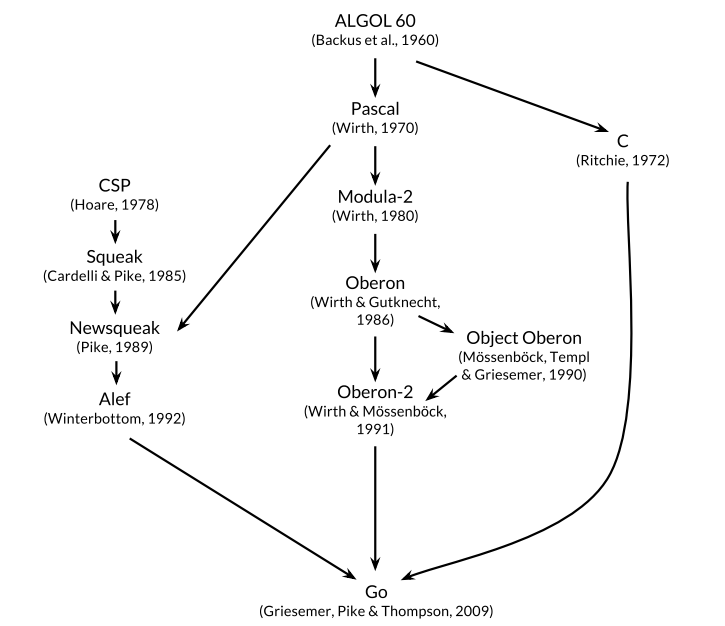

# The Go Programming Language

> Go is an open source programming language that makes it easy to build simple, reliable and
> efficient software

Go is especially well suited for building infrastructure

- Networked servers
- Tools
- Systems for programmers

But it is truly a general-purpose language and finds use in domains
as diverse as graphics, mobile applicationis, and maching learning.

## 1. The Origins of Go

The figure below shows the most important influences of ealier programming languages
on the design of Go



go is sometimes described as a `C-like language`, or as `C for the 21st century`

All but the most trivial code examples in the book are avaiable for download form the public Git
repository at `gopl.io`.

Each example is identified by its package import path and may be conventiently featched, built,
and installed using the `go get` command. You'll need to choose a directory to be your `Go workspace`
and set the `GOPATH` environment variable to point to it.

The `go` tool will create the directory if neccessary.

```sh
export GOPATH=$HOME/gobook
go get gopl.io/ch1/helloworld
$GOPATH/bin/helloworld
```

To run the examples, you will need at least versioin `1.5` of `Go`

```sh
go version
go version go1.5 linux/amd64
```

Follow the instructions at `https://golang.org/doc/install` if the `go` tool on your computer
is older or missing.

## 2. The Origins of Go

The best source for more information about Go is the official web site `https://golang.org`

- Documentation
- `Go Programming Language Specification`
- Standard packages

The `Go blog` at `blog.golang.org` publishes some of the best writing on Go

Go Playground at `play.golang.org`. The playground makes it convenient to perform simple experiments
to check one's understanding of syntax, semantics, or library packages with short programs, and in many ways
takes the place of a `read-eval-print-loop` (REPL) in other languages.

Built atop the Playground, the `Go Tour` at `tour.golang.org` is a sequence of short interactive lessons
on the basic ideas and constructions of `Go`, an orderly walk through the language.

Since `Go` is an open-source project, you can read the code for any type or function in the standard
library online at `https://golang.org/pkg`; the same code is part of the downloaded distribution.

Use this to figure out how something works, or to answer questions about details,
or merely to see how experts write really good `Go`.

## 3. Tutorial

This chapter is a tour of the basic components of `Go`.

### 3.1. Hello, World

```go
package main

import "fmt"

func main() {
 fmt.PrintLn("Hello")
}
```

`Go` is a compiled language. The `Go` toolchain converts a source program and the things it depends on
into intrstructions in the native machine language of a computer.

These tools are accessed through a single command called `go` that has a number of subcommands.

- `go run`:

  - compiles the source code from one or more source files whose names end in `.go`
  - links it with libraries
  - runs the resulting `executable` file.

                `go run helloworld.go`

`Go` natively handles `Unicode`.

- `go build`:

  - `go build helloworld.go`

  - compiles source
  - save the compiles for later use
  - creates an `executable` binary file
  - can be run with: `./helloworld`

`Go` code is organized into `packages`, which are similar to `libraries` or `modules` in other languages.

A `package` consists of one or more `.go` source files in a `single directory` that define what the `packages`
does.

Each `source file` begins with a `package declaration`, here `package main`, that states which `package` the
file `belongs to`, followed by `a list` of other `packages` that it `imports`, and then the
`declarations` of the program that are stored in that file.

The `Go standard library` has over `100 packages` for common tasks like input and output, sorting, and text
manipulation.

`fmp package`

- printing formatted output
- scanning input
- `PrintLn` is one of the basic `output functions` in `fmt`

  - Prints one or more values
  - Seperated by spaces
  - Newline character at the end

- `Package main is special`

  - `define` a standalone `executable` program, `not a library`
  - `function main`

    - where the execution of the program begins
    - whatever `main` does is what the program does
    - `main` will normally call upon functions in other packages to do much of the work

`import` declaration

- what packages are needed by this source file

You must import exactly the `packages` you need. A programm `will not` compile if there are missing
imports or if there are unneccessary ones.

This strict requirements prevents references to unused packages from accummulating as programs evolve.

Order

- `package` declaration
- `import` declaration
- declaration of `functions - func`, `variables - var`, `constants - const`, and `types - type`

A function declaration consists of

- keyword `func`
- the name of the function
- a parameter list (`empty for main`)
- a result list (`empty for main`)
- the body of the function

`Go` `does not` require `semicolons` at the ends of statements or declarations, `except` where two
or more `appear on the same line`.

In effect, newlines following certain tokens are converted into `semicolons`, so where newlines
are placed matters to proper parsing of `Go` code.

`Go` takes a strong stance on `code formatting`.

The `gofmt` tool rewrites code into the `standard format`, and the `go` tool's `fmt` subcommand applies
`gofmt` to all the files in the specified `package`, or the ones in the current directory by default.

Many text editors can be configured to run `gofmt` each time you save a file, so that your source code
is always properly formatted.

A related tool, `goimports`, additionally manages the `insertion` and `removal` of import
declarations as needed. it is not part of the `standard` distribution but you can obtain it with this command

```sh
go get golang.org/x/tools/cmd/goimports
```

### 3.2. Command-Line Arguments

The `os` package provides function sand othre values for `dealing with the operatating system` in a `platform-independent` fashion.

Command-line arguments are aviable to a program in a variable named `Args` that is part of the `os` package; thus its name
anywhere outside the `os` package is `os.Args`.

The variable `os.Args` is a `slice` of strings.

Slices are a fundamental notion in `Go`. For now, think of a `slice` as a deynamically sized sequence `s` of
array elements where individual elements can be accessed as `s[i]` and a contiguous subsequence as `s[m:n]`.

The number of elemts is given by `len(s)`.

All indexing in `Go` uses `half-open` intervals that include the first index but exclulde the last,
because it simplifies logic. For example, the slice `s[m:n]`, where `0 <= m <= n <= len(s)`, contains `n-m` elements.

The first element of `os.Args`, `os.Args[0]`, is the name of the command itself; the other elements are the arguments that
were presented to the program when it started execution.

We can get those in the slice `os.Args[1:len(os.Args)]`.

If `m` or `n` is omitted, it defaults to `0` or `len(s)` respectively, so we can abbreviatet the desired `slice` as `os.Args[1:]`

Here's an implementation of the `Unix echo` command, which prints its command-line arguments on a single line.

```go
package main

import (
 "fmt"
 "os"
)

func main() {
 var s, sep string

 for i := 1; i < len(os.Args); i++ {
  s += sep + os.Args[i]
  sep = " "
 }

 fmt.Println(s)
}
```

Comments begin with `//`.

By convention, we describe each package in a comment immediately preceding its package
declaration; for a `main package`, this comment is one or more complete esntences that describe the program as a whole.

The `var` declaration decalers two variables `s` and `sep`, of type `string`.

A variable can be initialized as part of its declaration.

If it is not explicitly initialized, it is implicitly initialized to the `zero value` for its type:

- `0` for numberic types
- `''` for strings.

The `+` operator is using for `concatenates` the values.

The statement we used in the program: `s += sep + os.Args[i]` is an `assignment statement` that concatenates
the old value of `s` with `sep` and `os.Args[i]` and assigns it back to `s`; it is equivalent to
`s = s + sep + os.Args[i]`.

The operator `+=` is an `assignment operator`.

The `:=` symbol is part of a `short variable declaration`, a statement that decalres one or more variables and gives them
`appropriate` types based on the `initializer values`.

The increment statement `i++` adds 1 to `i`; it's equivalent to `i += 1` which is in turn equivalent to `i = i + 1`.
These are statements, not expressions as they are in most languages in the `C family`

- `j = i++` is `illegal`
- they are postfix only, so `--i` is not legal either

The `for loop` is the only loop statement in `Go`. It has a number of forms, one of which is illustrated here

```go
for initialization; condition; post {
  // zero or more statements
}
```

Any of these parts may be omitted. If there is no `initializationi` and no `post`, the semicolons may also be omitted

```go
// a tranditional "while" loop

for condition {
  // ...
}
```

It the condition is omitted entirely in any of these forms, for example in

```go
// a traditional infinite loop

for {
  // ...
}
```

the loop is `infinite`, though loops of this form may be terminated in some other way, like
a `break` or `return` statement.

Another form of the `for loop` iterates `over a range` of values from a data type like a `string` or a `slice`. To illustrate, here's a second version of `echo`:

```go
package main

import (
 "fmt"
 "os"
)

func main() {
 s, sep := "", ""

 for _, arg := range os.Args[1:len(os.Args)] {
  s += sep + arg
  sep = " "
 }

 fmt.Println(s)
}
```

In each iteration of the `loop`, `range` produces a `pair of values`

- the `index`
- the `value`

of the element at that index.

In this example, we don't need the `index`, but the syntax of a `range` loop requires that if
we deal with the element, we must deal with the `index` too.

One idea would be to assign the index to an obviously temporary variable like `temp` and ignore its value.

The solution is to use the `blank identifier`, whose name is `_`.

There are several ways to declare a string variable; these are all equivalent

- `s := ""`: A short variable decalration, is the most compact, but it `may be used only within a function, not for package-level variables`.
- `var s string`: relies on default initialization to the `zero value` for strings, which is `""`
- `var s = ""`: rarely used except when declaring multiple variables
- `var s string = ""`: explicit about the variable's type

Each time around the loop, the string `s` gets completely new contents. The old contents of `s` are no longer in use, so
they will be `garbage-collected` in due course.

If the amount of data involved in large, this could be `costly`. A simpler and more efficient solution
would be to use the `Join` function from the `strings` package:

```go
func main() {
  fmt.Println(strings.Join(os.Args[1:], " "))
}
```

Finally if we don't care about format but just want to see the values perhaps for debugging, we can let `Println`
format the results for us:

```go
fmt.Println(os.Args[1:])
```

The output of this statement is like what we would get from `strings.Join`, but with surrounding brackets.
`Any slice may be printed this way`.

### 3.3. Finding Duplicate Lines

Programs for file `copying, printing, searching, sorting, counting`, and the like all have a similar structure

- `a loop over` the input
- some `computation` on each element
- generationi of output on the fly or at the end

We'll show three variants of a program called `dup`; it is partly inspired by the Unix `uniq` command, which
looks for adjacent duplicate lines.

The first version of `dup` prints each line that appears more than once in the standard input,
preceded by its count. This program introduces the `if` statement, the `map` data type, and the `bufio` package.

```go
package main

import (
 "bufio"
 "fmt"
 "os"
)

func main() {
 counts := make(map[string]int)
 input := bufio.NewScanner(os.Stdin)

 for input.Scan() {
  counts[input.Text()]++
 }

 // NOTE: ignoring potential errors from input.Err()
 for line, n := range counts {
  if n > 1 {
   fmt.Printf("%d\t%s\n", n, line)
  }
 }
}
```

As with `for`, parentheses are never used around the condition in an `if` statement, but braces are required for the body.
There can be optional `else` part that is executed if the condition is `false`.

A `map` holds a set of `key/value` pairs and provides `constant-time` operations to store, retrieve,
or test for an item in the `set`.

- The `key` may be of any type whose values can compared with `==`, `strings` being the most `common example`.
- The `value` may be of any type at all.

In this example, the `keys` are `strings` and the `values` are `ints`.

The `built-in` function `make` creates a `new empty map`; it has other uses too.

Each time `dup` reads a line of input, the line is used as a `key` into the `map` and the
corresponding value is incremented.

The statement `counts[input.Text()]++` is equivalent to these two statements

```go
line := input.Text()
counts[line] = counts[line] + 1
```

```go
package main

import (
  "bufio"
  "fmt"
  "os"
)

func main() {
  counts := make(map[string]int)
  input := bufio.NewScanner(os.Stdin)

  for input.Scan() {
        if input.Text() == "q" {
            break
        }
        
    counts[input.Text()]++
  }

    fmt.Printf("Map length: %d\n", len(counts))

  for line, n := range counts {
    fmt.Printf("%d\t%s\n", n, line)
  }
}
```

To print the results, we use another `range-based for loop`, this time over the `counts` map.
As before, each iteration produces two results, a `key` and the `value` of the map element for that `key`.

Onward to the `bufio` package, which helps make input and output efficient and convenient. One of its most
useful features is a type called `Scanner` that reads input and breaks it into lines or words, it's often
the easiest way to process input that comes naturally in lines.

```go
input := bufio.NewScanner(os.Stdin)
```

The scanner reads from the program's standard input.

- `input.Scan()` reads the next line and removes the newline character from the end
- `input.Text()` retrive the result
- `Scan` function returns `true` if there is a line and `false` when there is no more input

`Printf` has over a dozen such converions, which `Go` programmers call `verbs`. This table is far 
from a complete specification but illustrates many of the features that are available:

- `%d`: decimal integer
- `%x, %o, %b`: integer in hexadecimal, octal, binary
- `%f, %g, %e`: floating-point number
- `%t`: boolean: `true` or `false`
- `%c`: rune (`Unicode code point`)
- `%s`: string
- `%q`: quoted string "abc" or run 'c'
- `%v`: any value in natural format
- `%T`: type of any value
- `%%`: literal percent sign (no operand)

By convention, formatting functions whose names end in `f`
- `log.Printf`
- `fmt.Errorf`

Whereas those whose names end in `ln` follow `Println`
- formatting their arguments as if by `%v`
- followed by a newline

The next version of `dup` can read from the standard input or handle a list of file names, using
`os.Open` to open each one

```go
// Dup2 prints the count and text of lines that appear more than once
// in the input. It reads from stdin or from a list of named files
package main

import (
    "bufio"
    "fmt"
    "os"
)

func main()  {
    counts := make(map[string]int)
    files := os.Args[1:]
    
    if len(files) == 0 {
        countLines(os.Stdin, counts)
    } else {
        for _, arg := range files {
            f, err := os.Open(arg)
            
            if err != nil {
                _, _ = fmt.Fprintf(os.Stderr, "dup2: %v\n", err)
                continue
            }

            countLines(f, counts)
            _ = f.Close()
        }
    }
    
    for line, n := range counts {
        fmt.Printf("%d\t%s\n", n, line)
    }
}

func countLines(f *os.File, counts map[string]int) {
    input := bufio.NewScanner(f)
    
    for input.Scan() {
        counts[input.Text()]++
        
        if f == os.Stdin {
            if input.Text() == "q" {
                break
            }
        }
    }
}
```

The function `os.Open` returns two values. The first is an open file `*os.File` that is used in subsequent reads
by the `Scanner`.

The second result of `os.Open` is a value of the built-in `error` type.

If `err` equals the special `built-in` value `nil`, the file was opened successfully.

`Close` closes the file and releases any resources.

On the other hand, if `err` is not `nil`, something went wrong. Our simpole-minded error handling
prints a message on the `standard error stream` using `Fprintf` and the verb `%v`, which displays a value
of any type in a default format.

Notice that the call to `countLines` precedes its declaration. Functions and other `package-level` entities
may be declared in `any order`.

A `map` is a `reference` to the data structure created by `make`.

When a map is passed to a function, the function receives a copy of the reference, so any changes
the called function makes to the underlying data structure will be visible through the caller's map
`reference` too.

The versions of `dup` above operate in a `streaming` mode in which input is `read` and `broken` into 
lines as `needed`, so in principle these programs can handle an arbitrary amount of input.

An alternative approach is to read the `entire` input into `memory` in one big gulp, split it into lines
all at once, then process the lines.

The following version, `dup3`, operates in that fashin. It introduces the function `ReadFile` 
(from the `io/ioutil` package), which reads the entire contents of a named file, 
and `strings.Split`, which splits a string into a `slice` of `substrings`.

`Split` is the opposite of `strings.Join`.

```go
package main

import (
    "fmt"
    "io/ioutil"
    "os"
    "strings"
)

func main() {
    counts := make(map[string]int)
    
    for _, filename := range os.Args[1:] {
        data, err := ioutil.ReadFile(filename)
        
        if err != nil {
            _, err := fmt.Fprintf(os.Stderr, "dup3: %v\n", err)
            if err != nil {
                continue 
            }
            continue
        }
        
        for _, line := range strings.Split(string(data), "\n") {
            counts[line]++
        }
        
        for line, n := range counts {
            fmt.Printf("%d\t%s", n, line)
        }
    }
}
```

`ReadFile` returns a `byte slice` that must be converted into a `string` so it can be split by `strings.Split`.

Under the covers, `bufio.Scanner, ioutil.ReadFile and ioutil.WriteFile` use the `Read` and `Write` methods
of `*os.File`, but it's rare that most programmers need to access those `lower-level` routines directly.

The `higher-level` functions like those from `bufio` and `io/ioutil` are easier to use.

### 3.4. Animated GIFs

```go
package main

import (
    "image"
    "image/color"
    "image/gif"
    "io"
    "math"
    "math/rand"
    "os"
)

var palette = []color.Color{color.White, color.Black}

const (
    whiteIndex = 0 // first color in palette
    blackIndex = 0 // next color in palette
)

func main() {
    lissajous(os.Stdout)
}

func lissajous(out io.Writer) {
    const (
        cycles = 5 // number of complete x oscillator revolutions
        res = 0.001 // angular resolution
        size = 100 // image canvas covers [-size ... +size]
        nframes = 64 // number of animation frames
        delay = 8 // delay between frames in 10ms unit
    )
    
    freq := rand.Float64() * 3.0 // relative frequency of y oscillator
    anim := gif.GIF{LoopCount: nframes}
    phase := 0.0 // phase difference
    
    for i := 0; i < nframes; i++ {
        react := image.Rect(0, 0, 2 * size + 1, 2 * size + 1)
        img := image.NewPaletted(react, palette)
        
        for t := 0.0; t < cycles*2*math.Pi; t += res {
            x := math.Sin(t)
            y := math.Sin(t*freq + phase)
            
            img.SetColorIndex(size + int(x * size + 0.5), size + int(y * size + 0.5), blackIndex)
        }
        
        phase += 0.1
        anim.Delay = append(anim.Delay, delay)
        anim.Image = append(anim.Image, img)
    }

    err := gif.EncodeAll(out, &anim)
    if err != nil {
        return 
    }
}
```


When importing a package whose path has multiple components, like `image/color`, we refer to the package with a name 
that comes from the last component.

`const` declaration

- constants
- fixed values at the compile time
- appear at package level (visible throughout the package)
- within a function (visible only within that function)
- the values must be a `number`, `string`, or `boolean`

`composite literals`

- a compact notation for instantiating any of `Go`'s composite types from a sequence of element values

- `[]color.Color{...}`: initialize a `slice`
- `gif.GIF{...}`: initialize a `struct`
 

A `struct`

- group of values called `fields`
- collected togehter in a `single object`
- can be treated as a `unit`
- all the fields have the `zero value` for their type
- can be accessed using `dot notation`

The type of `out` is `io.Writer`, which lets us write to a wide range of possible destinations.

### 3.5. Fetching a URL

Go provides a collection of packages, grouped under `net`, that make it easy to send
and receive information through the `Internet`, make `low-level` network connections, 
and set up serers, for which `Go`'s concurrency features are particularly useful.


```go
package main

import (
    "fmt"
    "io/ioutil"
    "net/http"
    "os"
)

func main() {
    for _, url := range os.Args[1:] {
        response, err := http.Get(url)
        
        if err != nil {
            fmt.Fprintf(os.Stderr, "fetch: %v\n", err)
            os.Exit(1)
        }
        
        b, err := ioutil.ReadAll(response.Body)
        response.Body.Close()
        
        if err != nil {
            fmt.Fprintf(os.Stderr, "fetch: reading %s: %v\n", url, err)
            os.Exit(1)
        }
        
        fmt.Printf("%s", b)
    }
}
```

`http.Get`
  
  - makes `HTTP` request
  - return the result in the response `struct` `resp`
  - `Body` field contains the server response as a `readable stream`
  - `Close` to avoid leaking resources

`ioutil.ReadAll`
  
  - read the entire response
  - store result in `b`

`Printf` writes the `response` to the `standard ouput`

## 4. Program Structure 

One builds large programs from a small set of basic constructs

- variables store values
- simple expressions are combined into larger ones with operatiionis lke addition and substrction
- basic types are collected into aggregate like `arrays` and `structs`
- expressions are used in statements whose execution order is determined by `control-flow` statements like `if` and `for`
- statements are grouped into functions for `isolation and reuse`
- `functions` are gathered into `source files` and `packages`

### 4.1. Names

- a name begins with a letter
- underscore
- case matters

`constants`

- `true`
- `false`
- `iota`
- `nil`

`types`

- `int`
- `uint`
- `uintptr`
- `bool`
- `byte`
- `rune`
- `string`
- `error`


`functions`

- `make`
- `len`
- `cap`
- `new`
- `append`
- `copy`
- `close`
- `delete`
- `complex`
- `real`
- `imag`
- `panic`
- `recover`

An entity is declared

- `within a function`: it is `local` to that function
- `outside function`: visible in all files of the `package` to which it `belongs`

The case of a first letter of a name determines its `visibility` accross `package boundaries`

- the name begin with `an upper-case letter`: it is `exported`, visible outside ot its `own package`, such as `Printf` in the `fmt package`
- `package` name is always in `lowercase`
- use `camelCase`

### 4.2. Declarations 

> A declaration names a program entity and specifies some or all of its properties

`4 major kinds of declarations`

- `var`
- `const`
- `type`
- `func`

`package`: says what `package` the `file` is part of

```go
package main

import "fmt"

const boilingF = 212.0

func main)) {
  var f = boilingF
  var c = (f - 32) * 5 / 9
  fmt.Printf("boiling point = %gF or %gC\n", f, c)
}
```

- `constant boilingF` is a `package-level` declaration
- `f and c` are `local` to the function `main`

The `result list` is omitted if the function `does not` return anything

Make `reusable function`

```go
func fToC(f float64) float64 {
  return (f - 32) * 5 / 9
}
```

### 4.3. Variables 

`var`

- create a `variable`
- particular `type`
- attachs a name
- initialize value
- `var name type = expression`
- `type` or the `= expression` part may be omitted, but `not both`


`type is omitted`: automatically determined by the `initializer expression`

`expression is omitted`

- initial value is the `zero value` for the `type`

  - `0` for number
  - `false` for boolean
  - `""` for string
  - `nil` for `interface` and `reference` type: `slice, pointer, map, channel, function`

The `zero-value` mechanism ensures that a variable always holds a `well-defined` value of its type.
In `Go`, there is no such thing as `an unitialized variable`.

`Package-level` variables are initialized before `main` begins

```go
var i, j, k int // int, int, int
var b, f, s = true, 2.3, "four" // bool, float64, string

var f, err = os.Open(name) // os.Open returns a file and an error
```
